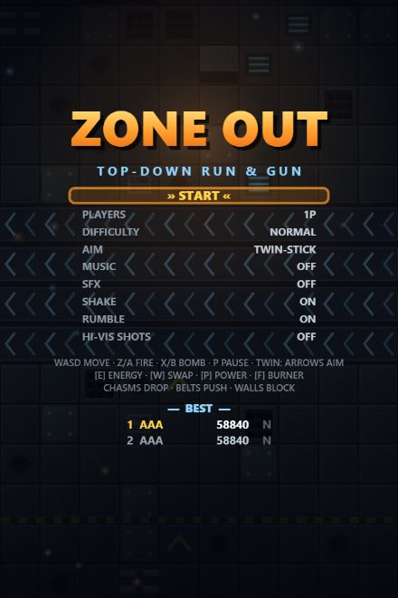
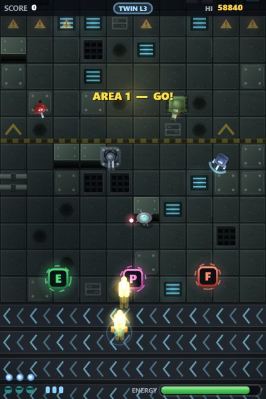
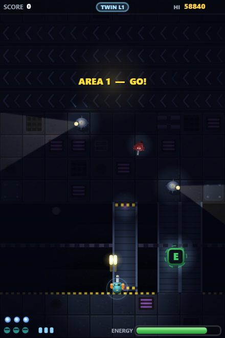
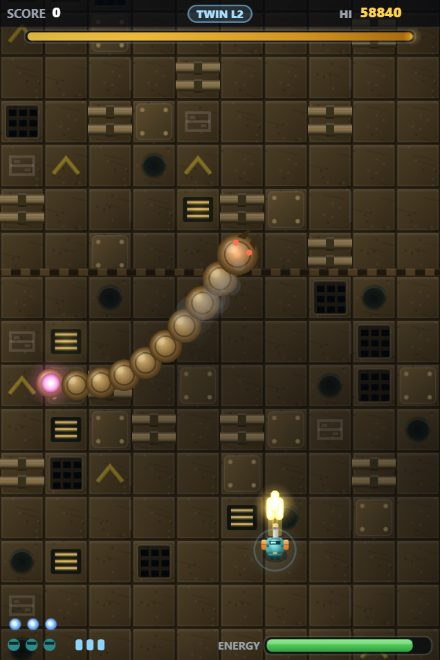

# ZONE OUT

An original top-down run-and-gun for web and mobile, in the spirit of classic
1990s arcade shooters. One self-contained HTML file — no frameworks, no build
step, no dependencies. All art, sound, music, and levels are generated in code.

## ▶ Play it

**https://adriandonohoe.github.io/ZoneOut/**

Works in any modern browser. On a phone, use *Add to Home Screen* to install
it as a fullscreen app (PWA) — it also works offline after the first visit.

| Title | Combat | Blackout Sector | Sand Wyrm |
|---|---|---|---|
|  |  |  |  |

## Features

- **7 areas**: green metalworks, rust belt, a blackout sector fought in
  darkness under enemy searchlights, flooded docks, wasteland, prison
  stockade, and a final carrier assault — then it loops, harder.
- **8 bosses** with destructible parts and distinct mechanics: a fortress with
  cannon pods, a charging siege crawler, a night gunship that kills your
  lights, a barge that floods the arena, a burrowing sand wyrm that is only
  vulnerable at the tail, a warden that cages you in rising walls, twin
  interceptors where the survivor enrages, and a shielded carrier that
  launches its own escort.
- **Living terrain**: chasms you (and enemies) can fall into, bridges and
  sliding platforms, conveyor belts, wading water, and walls that block
  movement and bullets for both sides.
- **Out Zone-style energy system**: your meter always drains — grab [E] cells
  to stay alive. [W] swaps twin shot / 8-way, [P] stacks weapon power,
  [F] grants a piercing super burner, bombs clear the screen.
- **Chain scoring** with an end-of-area bonus tally and a persistent top-5
  hi-score table with initials entry.
- **2-player local co-op** (keyboard + gamepad, or two gamepads).
- **Difficulty & accessibility options**: Normal (3-hit shield) or Arcade
  (one-hit deaths), classic or twin-stick aiming, screen-shake / rumble /
  high-visibility-bullet toggles.

## Controls

| Action | Keyboard | Gamepad | Touch |
|---|---|---|---|
| Move | WASD | Left stick / d-pad | Left side: floating stick |
| Fire | Z / J / Space | A / RT | Hold right side |
| Aim (twin-stick mode) | Arrow keys | Right stick | Right side stick |
| Bomb | X / K | B / X | Bomb button |
| Pause | P | Start | Pause button |

In classic mode your facing locks while firing (strafe). In 2P, player 1 uses
the keyboard and player 2 a gamepad.

## Run locally

Open `index.html` in a browser — that's it. For the service worker (offline
support) serve the folder instead:

```
python -m http.server 8123
```

then open http://localhost:8123.

---

Built with [Claude Code](https://claude.com/claude-code).
